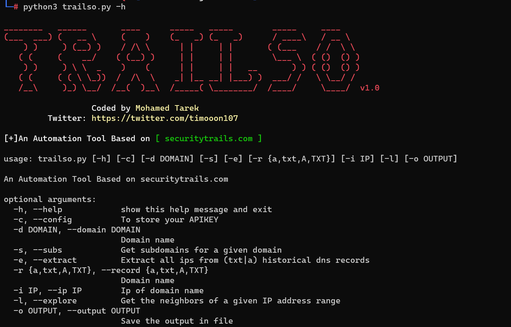

# trailso
[+] An Automation Tool Based on [ securitytrails.com ]


### Setup:
```
pip3 install -r requirement.txt
```

### Usage:
```
python3 trailso.py -h
________   ______       ____      _____   _____        _____     ____
(___  ___) (   __ \     (    )    (_   _) (_   _)      / ____\   / __ \
    ) )     ) (__) )    / /\ \      | |     | |       ( (___    / /  \ \
   ( (     (    __/    ( (__) )     | |     | |        \___ \  ( ()  () )
    ) )     ) \ \  _    )    (      | |     | |   __       ) ) ( ()  () )
   ( (     ( ( \ \_))  /  /\  \    _| |__ __| |___) )  ___/ /   \ \__/ /
   /__\     )_) \__/  /__(  )__\  /_____( \________/  /____/     \____/  v1.0

                  Coded by Mohamed Tarek
         Twitter: https://twitter.com/timooon107

[+] An Automation Tool Based on [ securitytrails.com ]

usage: trailso.py [-h] [-c] [-d DOMAIN] [-s] [-e] [-r {a,txt,A,TXT}] [-i IP] [-l] [-o OUTPUT]

An Automation Tool Based on securitytrails.com

optional arguments:
  -h, --help            show this help message and exit
  -c, --config          To store your APIKEY
  -d DOMAIN, --domain DOMAIN
                        Domain name
  -s, --subs            Get subdomains for a given domain
  -e, --extract         Extract all ips from (txt|a) historical dns records
  -r {a,txt,A,TXT}, --record {a,txt,A,TXT}
                        Domain name
  -i IP, --ip IP        Ip of domain name
  -l, --explore         Get the neighbors of a given IP address range
  -o OUTPUT, --output OUTPUT
                        Save the output in file
```

### Add your free APIKEY :

```
python3 trailso.py --config

Enter your APIKEY:**************qwa
```


###  Get subdomains for a given domain name :
```
python3 trailso.py --subs -d example.com
```

###  Extract all ips from (txt|a) historical dns records :
```
 python3 trailso.py --extract -d example.com --record A
 ```
###  Get the neighbors of a given IP address range :
```
 python3 trailso.py --explore -i 10.10.10.10
 ```
#### Donation
If this tool help you reduce time and you love it, you can give me a cup of coffee :) 

[](https://paypal.me/mtarek107)
 


